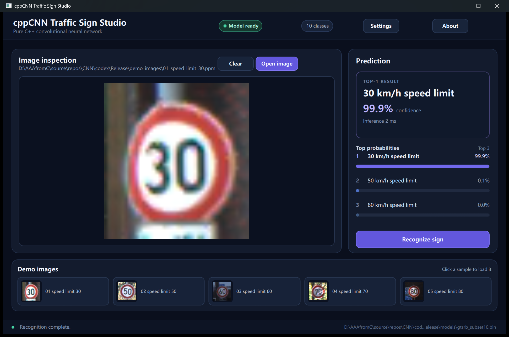

# 纯 C++ CNN 交通标志识别系统

## 项目简介

这是 `cppCNN_vibecoding` 仓库的 Codex 实现。项目使用 C++17 从零实现 LeNet 风格 CNN 的 Tensor、卷积、池化、激活、全连接、Softmax、损失、反向传播、训练和模型持久化，并使用 Qt Quick/QML 提供现代桌面界面。

OpenCV 是可选依赖，仅用于 CLI 的常见图片读取和显示。Qt GUI 使用 `QImage` 读取 PPM、PNG、JPEG 和 BMP，不依赖 OpenCV，也不使用 PyTorch、TensorFlow 或 Keras。



## 功能列表

- 纯 C++ CNN 前向传播、反向传播和 mini-batch SGD 训练
- GTSRB 官方原始目录、测试 CSV 和可配置子集读取
- 10 类开发模型与扩展到 43 类的动态输出层
- 二进制模型保存、加载、格式版本及参数数量检查
- CLI 训练、评估、单图预测和交互预测
- Qt Quick 深色桌面 GUI
- 图片选择、拖放、预览、清除和错误提示
- 后台线程推理，界面不会因 CNN 计算阻塞
- Top-1、置信度、推理时间和 Top-3 概率条
- 五张 GTSRB 演示图片，点击即可识别
- 模型缺失时安全启动并允许手动选择
- CTest 核心测试与 GUI 控制器测试
- Windows 便携 Release 打包

## 环境依赖

必需：

- Windows 10/11 x64
- Visual Studio 2022，安装“使用 C++ 的桌面开发”
- CMake 3.20+
- Qt 6 MSVC 2022 64-bit，包含 Core、Gui、Quick、QML、Quick Controls 2、Concurrent

当前验证环境：

- Qt 6.11.1 MSVC 2022 x64
- MSVC 19.44
- CMake 4.2.0-rc3
- Ninja 1.12.1

可选：

- Qt Creator 19.0.2
- OpenCV 4.x，仅增强 CLI 图片格式与窗口显示

## 数据集准备

完整数据放在以下目录，且不会进入 Git：

```text
codex/datasets/GTSRB/
├── GTSRB/Final_Training/Images/00000 ... 00042/
├── GTSRB/Final_Test/Images/
└── GT-final_test.csv
```

开发阶段默认使用：

```text
codex/datasets/GTSRB_subset/
├── train/00000 ... 00009/
├── test/00000 ... 00009/
└── labels.txt
```

当前子集包含 10 类，每类 1,000 张训练图，共 10,000 张训练图。下载来源、校验值、完整目录和子集生成命令见 [`docs/dataset_guide.md`](docs/dataset_guide.md)。

## 编译方式

在仓库根目录执行：

```powershell
cmake -S codex -B codex/build `
  -G "Visual Studio 17 2022" -A x64 `
  -DCMAKE_PREFIX_PATH="C:\Qt\6.11.1\msvc2022_64"

cmake --build codex/build --config Release
ctest --test-dir codex/build -C Release --output-on-failure
```

没有 Qt 时，CMake 会跳过 `cppcnn_gui`，CLI 和核心测试仍可构建。也可以显式设置 `-DCPPCNN_BUILD_GUI=OFF`。

## 运行方式

GUI：

```powershell
.\codex\build\Release\cppcnn_gui.exe
```

默认模型搜索顺序：

1. 可执行文件同级的 `models/gtsrb_subset10.bin`
2. 开发目录 `codex/models/gtsrb_subset10.bin`

标签搜索顺序：

1. 可执行文件同级 `labels.txt`
2. `datasets/GTSRB_subset/labels.txt`
3. `assets/labels.txt`

CLI 训练：

```powershell
.\codex\build\Release\cppcnn_app.exe train `
  codex\datasets\GTSRB_subset `
  codex\models\gtsrb_subset10.bin 10 5 0
```

CLI 评估：

```powershell
.\codex\build\Release\cppcnn_app.exe evaluate `
  codex\datasets\GTSRB_subset `
  codex\models\gtsrb_subset10.bin 0
```

CLI 单图预测：

```powershell
.\codex\build\Release\cppcnn_app.exe predict `
  codex\Release\demo_images\01_speed_limit_30.ppm `
  codex\models\gtsrb_subset10.bin `
  codex\assets\labels.txt
```

## Release 演示包

生成本机便携包：

```powershell
.\codex\scripts\package_release.ps1 `
  -BuildDirectory D:\AI\data\codex\cache\staging\cppcnn-release-build `
  -ModelPath .\codex\models\gtsrb_subset10.bin `
  -QtRoot C:\Qt\6.11.1\msvc2022_64
```

完成后双击 [`Release/run_demo.bat`](Release/run_demo.bat)。本地 Release 包包含 GUI、CLI、Qt DLL、QML 模块、插件、模型、标签和演示图，无需安装 Qt、Visual Studio、Python、OpenCV 或数据集。

Qt 运行库和模型由脚本生成但不提交 Git；`cppcnn_gui.exe`、启动脚本和说明文件被跟踪。

## 项目结构

```text
codex/
├── assets/                 # 43 类默认标签
├── datasets/               # 本地数据集与来源说明，图片不入 Git
├── docs/                   # 报告、设计说明、数据集指南、GUI 截图
├── models/                 # 本地模型与格式说明，权重不入 Git
├── qml/                    # Qt Quick 主界面和复用组件
├── Release/                # 教师演示包
├── scripts/                # 子集工具与 Release 打包脚本
├── src/
│   ├── app/                # CLI 应用流程
│   ├── cnn/                # 纯 C++ CNN 核心
│   ├── data/               # GTSRB DataLoader
│   ├── gui/                # Qt 控制器、图片桥接和 GUI 入口
│   ├── image/              # 通用图片预处理
│   └── ui/                 # 可选 OpenCV 简易窗口
├── tests/                  # 核心与 GUI 控制器测试
└── CMakeLists.txt
```

## 当前限制

- CPU 朴素循环实现，完整 43 类训练耗时较长。
- 网络输入固定为 `3 x 32 x 32` RGB。
- 当前优化器为 SGD，不含 Adam、BatchNorm、数据增强或学习率调度。
- GUI 主要面向推理演示，训练仍通过 CLI 完成。
- Git 仓库不包含 GTSRB 和模型权重；需下载、训练或使用本地 Release 包。
- Qt 官方部署会产生约 86 MiB 的本地便携目录。

## 后续改进

- 使用 OpenMP、SIMD 或 im2col 加速卷积
- 增加数据增强、验证集、早停和学习率调度
- 增加混淆矩阵、每类准确率和批量预测页
- 训练完整 43 类模型并发布为 GitHub Release 资产
- 增加 GUI 内训练进度、模型管理和中英文切换
