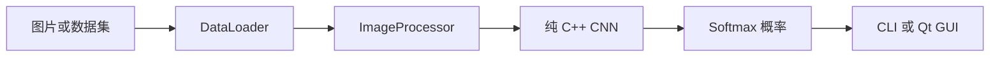

# 报告撰写指南

## 推荐目录

1. 选题背景与目标
2. CNN 基本原理
3. 需求分析
4. 系统总体设计
5. 数据集与预处理
6. CNN 网络结构
7. 核心模块实现
8. 训练与模型管理
9. GUI 设计
10. 实验结果
11. 问题、限制与改进
12. 总结

`report_materials/project_report.md` 已提供初稿，可在此基础上整理，但应使用自己的课程格式和表达。

## 可以确认的事实

| 项目 | 当前稳定版本情况 |
| --- | --- |
| 实现语言 | C++17 |
| CNN 核心 | 自己实现 |
| 深度学习框架 | 未使用 |
| 输入尺寸 | `3 x 32 x 32` |
| 当前便携模型类别 | 10 类 |
| 当前便携模型训练图片 | 10,000 |
| 当前便携模型测试图片 | 5,670 |
| Epoch | 5 |
| 训练准确率 | 94.61% |
| 测试 Top-1 | 89.63% |
| GUI | Qt Quick/QML |

## 容易写错的地方

### “支持 43 类”不等于“当前模型已经训练了 43 类”

代码的输出层和 DataLoader 可以配置为 43 类，但当前便携 Release 默认模型是 10 类。报告应写成：

> 系统结构支持扩展到完整 43 类；当前稳定演示模型采用 10 类开发子集。

### 两个 10 类模型不能直接比较强弱

语义均衡模型的测试准确率为 92.63%，但类别集合和测试样本与默认模型不同。不能只根据两个百分比断言它整体更强。

### OpenCV 不是 CNN 框架

OpenCV 只是可选的图片读取和窗口显示依赖。卷积、池化、激活、全连接、Softmax、损失和训练均由 C++ 代码实现。

## 图片和图表建议

报告至少加入：

- GUI 主界面截图
- CNN 网络结构图
- 系统模块图
- 图片预处理流程图
- 训练/推理流程图
- 实验结果表

可以使用以下 Mermaid 内容生成模块图：



## 实验结果写法

先说明实验条件，再给结果：

```text
数据集：GTSRB 10 类开发子集
训练样本：10,000
测试样本：5,670
输入尺寸：32x32 RGB
Epoch：5
Batch size：16
测试 Top-1：89.63%
```

不要只写一个准确率，也不要虚构混淆矩阵或 43 类结果。

## 引用代码

引用代码时写出相对路径，例如：

```text
source/src/cnn/ConvLayer.cpp
```

建议每次只引用 10-25 行关键代码，并配合文字解释。
